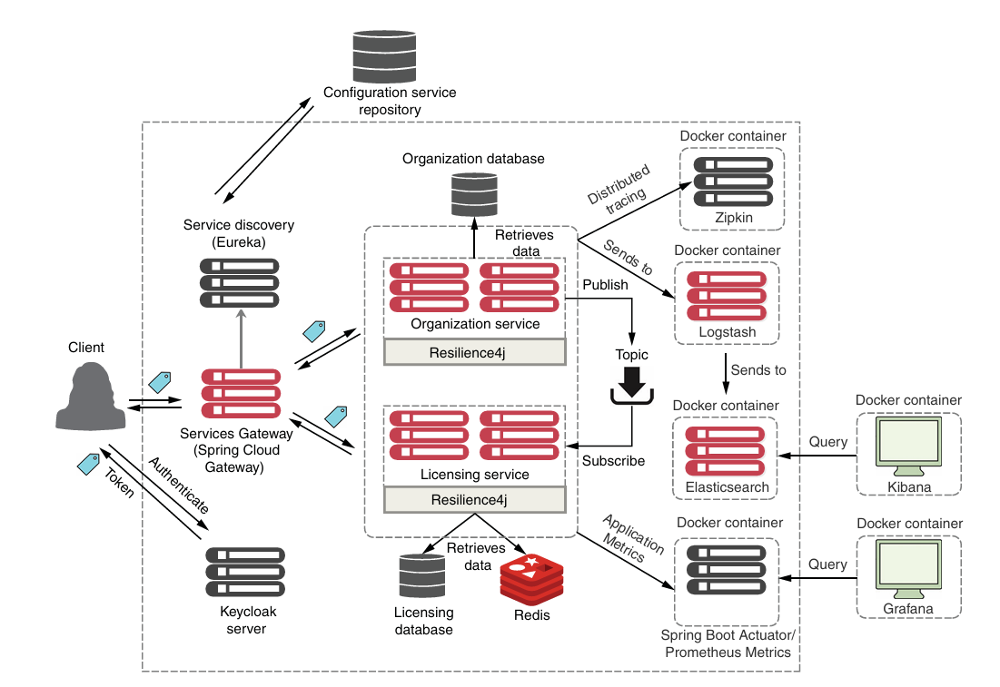

# sma-modernized

## Descripción del proyecto

Sistema de gestión de licencias y organizaciones construido con arquitectura de
microservicios usando Spring Boot y Spring Cloud. El sistema se desarrolla de
forma incremental por etapas, aplicando buenas prácticas cloud-native con el stack
moderno de Spring: configuración centralizada, descubrimiento de servicios,
puerta de enlace única, tolerancia a fallos, seguridad OAuth2/JWT, mensajería
asíncrona y caché distribuida.

## Stack tecnológico

| Tecnología | Versión | Rol en el sistema |
|---|---|---|
| Java | 21 | Lenguaje base |
| Spring Boot | 3.3.x | Framework de los microservicios |
| Spring Cloud | 2023.x | Soporte para arquitectura de microservicios |
| Spring Cloud Config | 2023.x | Configuración centralizada |
| Spring Cloud Netflix Eureka | 2023.x | Descubrimiento de servicios |
| Spring Cloud Gateway | 2023.x | Entrada única y enrutado |
| Spring Cloud LoadBalancer | 2023.x | Balanceo por descubrimiento |
| Resilience4j | — | Tolerancia a fallos (circuit breaker, retry, bulkhead, rate limiter) |
| Spring Cloud Stream | 2023.x | Abstracción de mensajería |
| Apache Kafka | 4.2.0 (KRaft) | Broker de mensajería asíncrona |
| Spring Data Redis / Redis | 7 | Caché distribuida |
| Spring Security + OAuth2 | 6 | Seguridad de los servicios |
| Keycloak | — | Servidor de identidad (OAuth2/JWT) |
| Micrometer Tracing + Zipkin | — | Trazabilidad distribuida (en preparación, Etapa 9) |
| PostgreSQL | — | Persistencia relacional |
| Maven | — | Construcción (monorepo multi-módulo) |
| Docker + Docker Compose | — | Orquestación local |

## Arquitectura del sistema



Los clientes acceden al sistema exclusivamente a través del `gateway-server`
(puerto `8072`), que enruta hacia los servicios de negocio descubiertos en Eureka.
Los servicios obtienen su configuración del `config-server`, validan los tokens
JWT emitidos por Keycloak, se comunican de forma síncrona (REST con balanceo por
descubrimiento) y asíncrona (eventos en Kafka), y emplean Redis como caché
distribuida.

## Servicios

| Servicio | Descripción | Puerto |
|---|---|---|
| `config-server` | Configuración centralizada | `8888` |
| `eureka-server` | Descubrimiento de servicios | `8761` |
| `gateway-server` | Entrada única y enrutado | `8072` |
| `keycloak` | Servidor de identidad OAuth2/JWT | `8080` |
| `zipkin` | Trazabilidad distribuida | `9411` |
| `postgres` | Base de datos (`sma_licensing`, `sma_organization`) | `5432` |
| `kafka` | Broker de mensajería (KRaft) | `9092` (interno) |
| `redis` | Caché distribuida | `6379` (interno) |
| `organization-service` | Gestión de organizaciones | Sin puerto público (vía Eureka / gateway) |
| `licensing-service` | Gestión de licencias | Sin puerto público (vía Eureka / gateway) |

## Ejecución del sistema completo

**Prerrequisitos:** Docker y Docker Compose instalados.

```bash
# 1. Crear el archivo de variables de entorno
cp .env.example .env
# Editar .env con los valores apropiados para tu entorno

# 2. Levantar todo el sistema
docker compose up --build

# 3. Verificar que los servicios están en pie
docker compose ps
```

El acceso a la API se hace siempre por el gateway en `http://localhost:8072`,
con un token OAuth2 obtenido de Keycloak (realm `sma`).

**Detener el sistema:**

```bash
docker compose down
```

## Variables de entorno

El archivo `.env` en la raíz controla la configuración del sistema. Cópialo desde
`.env.example` y ajusta los valores según tu entorno.

| Variable | Descripción | Valor de ejemplo |
|---|---|---|
| `SPRING_PROFILES_ACTIVE` | Perfil de Spring activo en los servicios | `default` |
| `CONFIG_SERVER_URI` | URL del `config-server` para los clientes | `http://config-server:8888` |
| `EUREKA_SERVER_URI` | URL del `eureka-server` para el registro | `http://eureka-server:8761/eureka` |
| `ZIPKIN_URI` | URL del servidor Zipkin | `http://zipkin:9411` |
| `DB_HOST` | Host de PostgreSQL | `postgres` |
| `DB_PORT` | Puerto de PostgreSQL | `5432` |
| `DB_USER` | Usuario de la base de datos | `sma_user` |
| `DB_PASSWORD` | Contraseña de la base de datos | `changeme` |
| `REDIS_HOST` | Host de Redis | `redis` |
| `REDIS_PORT` | Puerto de Redis | `6379` |

## Estado del proyecto

| Etapa | Descripción | Estado |
|---|---|---|
| Paso 0 | Inicialización del monorepo | ✅ Completada |
| Etapa 1 | `config-server` + `eureka-server` | ✅ Completada |
| Etapa 2 / 2b | `licensing-service`: REST + i18n + HATEOAS + capa Docker | ✅ Completada |
| Etapa 3 | Persistencia con PostgreSQL y Spring Data JPA | ✅ Completada |
| Etapa 4 | `organization-service` + comunicación entre servicios + correlationId | ✅ Completada |
| Etapa 5 | Resilience4j: circuit breaker, retry, bulkhead, rate limiter | ✅ Completada |
| Etapa 6 | `gateway-server`: rutas, pre-filter y post-filter | ✅ Completada |
| Etapa 7 | Seguridad OAuth2 + JWT con Keycloak | ✅ Completada |
| Etapa 8 | Mensajería asíncrona con Kafka + caché con Redis | ✅ Completada |
| Etapa 9 | Trazabilidad distribuida con Micrometer + Zipkin | 🔜 Pendiente |
| Posteriores | Observabilidad (ELK, Prometheus/Grafana) y despliegue en cloud | ⏸️ Fuera del alcance actual |
